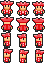

# Planeta do Tesouro

[](https://en.wikipedia.org/wiki/C_(programming_language))
[](https://www.raylib.com/)
[](https://www.raylib.com/)

Jogo de aventura 2D em C usando Raylib. Navegue por labirintos, colete tesouros, evite inimigos e use portais de teletransporte em uma experiência completa com gráficos, áudio e interface interativa!

**Projeto educativo** - Monitoria Fundamentos da Programação 2 (2025/2)

## Funcionalidades

### 🎮 Sistema de Jogo
- **Sistema de múltiplas fases** com progressão automática
- **Múltiplos tesouros** por fase com contador em tempo real
- **Sistema de vidas** com itens de cura coletáveis
- **Cronômetro integrado** para cada fase e tempo total
- **Ranking de recordes** com salvamento persistente
- **Verificação de arquivos** - detecta mapas disponíveis automaticamente
- **Transição controlada** entre fases (requer ENTER para avançar)

### 🎨 Interface e Gráficos
- **Menu principal interativo** com navegação por mouse
- **Sprites customizados** para todos os elementos do jogo
- **Background animado** com movimento diagonal contínuo
- **Interface visual completa** com HUD de informações
- **Tela de Game Over estilizada** com botão de retorno
- **Sistema de tutorial** integrado
- **Animações de sprites direcionais** para personagens

### 🎵 Sistema de Áudio
- **Efeitos sonoros** para todas as ações (coleta, dano, cura, teletransporte)
- **Músicas de fundo** diferenciadas para menu e gameplay
- **Sistema de áudio separado** para melhor organização
- **Controle de volume** automatizado

### 🚪 Sistema de Portais
- **Portais numerados** (1-9) para teletransporte
- **Teletransporte bidirecional** entre portais do mesmo número
- **Efeito sonoro** de teletransporte

### 🤖 Inteligência Artificial
- **Inimigos com IA** que perseguem o jogador
- **Sprites direcionais** com animação de movimento
- **Sistema de invencibilidade** temporária após dano

## Elementos do Jogo

| Símbolo | Sprite | Descrição |
|---------|--------|-----------|
| `@` |  | Jogador (sprites direcionais 4 direções) |
| `#` |  | Parede (intransponível) |
| `.` |  | Caminho livre |
| `T` |  | Tesouro (coletável) |
| `I` |  | Inimigo (sprites direcionais com IA) |
| `C` |  | Item de cura (+1 vida) |
| `1-9` |  | Portais numerados (teletransporte) |

## Sistema de Áudio

### 🎵 Músicas
- **Menu**: Música ambiente para navegação
- **Gameplay**: Trilha sonora principal durante o jogo

### 🔊 Efeitos Sonoros
- **Coleta de tesouro**: Som de sucesso
- **Cura**: Som de recuperação de vida
- **Dano**: Som de impacto quando atingido por inimigo
- **Teletransporte**: Som de portal
- **Início de jogo**: Som de confirmação
- **Game Over**: Som de derrota

## Inimigos e Combate

### 🤖 Comportamento da IA
- **Movimento**: Perseguem o jogador usando pathfinding simples
- **Frequência**: Movem-se a cada 0.5 segundos
- **Estratégia**: Aproximam-se primeiro horizontalmente, depois verticalmente
- **Sprites**: Animação direcional (4 direções) baseada no movimento

### ⚔️ Sistema de Combate
- **Colisão**: Reduz 1 vida do jogador
- **Invencibilidade**: 2 segundos de proteção após dano (sprite pisca)
- **Efeito visual**: Jogador fica semi-transparente durante invencibilidade
- **Som**: Efeito sonoro de dano quando atingido
- **Game Over**: Ocorre quando vidas chegam a zero

### 💚 Sistema de Cura
- **Itens de vida** (`C`): Restauram +1 vida quando coletados
- **Efeito sonoro**: Som específico de cura
- **Limite**: Sem limite máximo de vidas (estratégia de sobrevivência)

## Instalação

**Pré-requisitos:** GCC, Make, Raylib (incluído no projeto)

```bash
git clone https://github.com/vitorviana1011/PlanetaDoTesouro
cd PlanetaDoTesouro
make run
```

**Instalação manual do Raylib (Ubuntu/Debian):**
```bash
sudo apt install libraylib-dev
```

**Estrutura do projeto:**
```
PlanetaDoTesouro/
├── recursos/
│   ├── sprites/          # Todas as texturas do jogo
│   └── sons/            # Efeitos sonoros e músicas
├── mapas/               # Arquivos de fases (.txt)
├── includes/            # Headers (.h)
├── *.c                  # Código fonte
├── Makefile            # Sistema de build
└── README.md           # Este arquivo
```

## Como Jogar

### 🎮 Controles
- **Movimento**: Setas do teclado (↑↓←→)
- **Menu**: Clique do mouse ou teclas
- **Confirmar**: ENTER
- **Sair**: ESC

### 🎯 Objetivo
1. **Colete todos os tesouros** (`T`) de cada fase
2. **Evite ou gerencie inimigos** (`I`) usando itens de cura
3. **Use portais numerados** (1-9) para teletransporte estratégico
4. **Complete todas as fases** no menor tempo possível

### 📊 Interface (HUD)
- **Fase**: Número da fase atual
- **Tesouros**: Progresso na coleta (X/Y coletados)
- **Vidas**: Quantidade atual de vidas
- **Tempo**: Cronômetro da fase atual e tempo total

### 🏆 Progressão
1. **Complete uma fase**: Colete todos os tesouros
2. **Transição**: Aparece "Fase Completa! Aperte ENTER para continuar"
3. **Avance**: Pressione **ENTER** para próxima fase
4. **Ranking**: Ao final, registre seu nome no ranking de recordes

### 🎵 Experiência Audiovisual
- **Música ambiente** diferente para menu e jogo
- **Efeitos sonoros** para cada ação
- **Sprites animados** com direções de movimento
- **Interface estilizada** com tema de madeira e ouro

## Formato do Mapa

### 📄 Estrutura do arquivo
```
10 24
######################
#P.........C.........T#
#....................#
#.........###........#
#.........#I#........#
#.........###........#
#....................#
#..1.................2#
#C...................#
######################
```

**Primeira linha**: `linhas colunas`
**Demais linhas**: Grid do labirinto (10 linhas x 24 colunas)

### 📝 Elementos válidos
| Símbolo | Função | Obrigatório |
|---------|--------|-------------|
| `@` | Posição inicial do jogador |
| `#` | Parede |
| `.` | Chão livre |
| `T` | Tesouro |
| `I` | Inimigo |
| `C` | Item de cura |
| `1`-`9` | Portais numerados |

### 🔧 Regras técnicas
- **Arquivos**: `mapas/mapa1.txt`, `mapas/mapa2.txt`, etc.
- **Detecção automática**: O jogo verifica quais mapas existem
- **Validação**: Deve haver exatamente 1 jogador (`@`) por mapa
- **Portais**: Devem ser usados em pares (mesmo número)

## Comandos Make

```bash
make run      # Compila e executa o jogo
make clean    # Remove arquivos compilados  
make debug    # Inicia debugger (gdb)
make help     # Mostra ajuda do Makefile
```

## Arquitetura do Código

### 📁 Estrutura modular
```
planetadotesouro.c    # Loop principal e coordenação
├── desenhos.c        # Sistema de renderização e interface
├── audio.c          # Sistema de áudio (sons e músicas)  
├── logicaJogo.c     # Mecânicas de gameplay
├── inimigo.c        # Inteligência artificial dos inimigos
└── manipulaArquivos.c # Carregamento de mapas e persistência
```

### 🧩 Principais sistemas
- **Estados do jogo**: MENU → JOGANDO → ENTRE_FASES → GAME_OVER → RANKING
- **Gerenciamento de recursos**: Texturas, sons, mapas com carregamento/liberação
- **Sistema de colisão**: Detecção precisa para movimento e interações
- **Persistência**: Ranking de recordes salvo em arquivo binário
- **Áudio**: Sistema separado para melhor organização e manutenção
## Funcionalidades Técnicas

### 💾 Gerenciamento de Memória
- **Alocação dinâmica**: Mapas e inimigos alocados conforme necessário
- **Liberação segura**: Toda memória é liberada ao final
- **Detecção de vazamentos**: Estruturas zeradas após liberação

### 🎨 Sistema Gráfico
- **Sprites customizados**: Texturas PNG para todos os elementos
- **Animações direcionais**: 4 direções para jogador e inimigos
- **Background animado**: Movimento diagonal contínuo
- **Interface responsiva**: Botões com hover e efeitos visuais
- **Renderização em camadas**: Background → Mapa → Entidades → UI

### 🎵 Sistema de Áudio
- **Arquitetura modular**: Sistema separado em `audio.c/audio.h`
- **Múltiplos formatos**: Suporte a MP3 para sons e músicas
- **Controle de volume**: Configuração automática de níveis
- **Estados independentes**: Música do menu vs gameplay

### 📊 Sistema de Estados
```
MENU ↔ TUTORIAL
  ↓
JOGANDO → GAME_OVER
  ↓           ↓
ENTRE_FASES  MENU
  ↓
JOGO_COMPLETO → TELA_RESULTADOS → TELA_INPUT_NOME → RANKING
```

## Conceitos Demonstrados

### 🎓 Fundamentos da Programação
- **Estruturas de dados**: Arrays 2D, structs, enums
- **Ponteiros**: Passagem por referência, alocação dinâmica
- **Gerenciamento de memória**: `malloc()`, `free()`, prevenção de vazamentos
- **Manipulação de arquivos**: Leitura/escrita, verificação de existência
- **Modularização**: Separação de responsabilidades em múltiplos arquivos

### 🎮 Desenvolvimento de Jogos
- **Game loop**: Atualização → Lógica → Renderização
- **Máquina de estados**: Controle de fluxo e transições
- **Detecção de colisão**: Algoritmos de intersecção
- **Inteligência artificial**: Pathfinding simples para inimigos
- **Interface de usuário**: Menus interativos, HUD informativo

### 🔧 Engenharia de Software
- **Arquitetura limpa**: Separação clara de responsabilidades
- **Sistema de build**: Makefile com detecção automática de dependências
- **Controle de versão**: Git com commits organizados
- **Documentação**: README completo e comentários no código

## Autor

**Vitor Viana** - vitorluizcviana@gmail.com

**Monitoria Fundamentos da Programação 2 - 2025/2**

---

### 🎯 Sobre o Projeto
Este jogo foi desenvolvido como material educativo para demonstrar conceitos fundamentais da programação em C, incluindo estruturas de dados, gerenciamento de memória, manipulação de arquivos e programação gráfica. 

O projeto evoluiu de um simples labirinto para um jogo completo com gráficos, áudio, IA, interface interativa e sistema de ranking, servindo como exemplo prático de como organizar e estruturar projetos de software.

### 🚀 Tecnologias Utilizadas
- **Linguagem**: C (C99)
- **Gráficos**: Raylib 4.x
- **Áudio**: Sistema integrado Raylib (MP3)
- **Build**: GNU Make
- **Controle de versão**: Git

### 📈 Evolução do Projeto
1. **v1.0**: Sistema básico de labirinto
2. **v2.0**: Múltiplas fases e sistema de tesouros
3. **v3.0**: Inimigos com IA
4. **v4.0**: Sistema gráfico completo (sprites)
5. **v5.0**: Sistema de áudio integrado
6. **v6.0**: Interface interativa e ranking
7. **v7.0**: Sistema de portais e refinamentos finais
